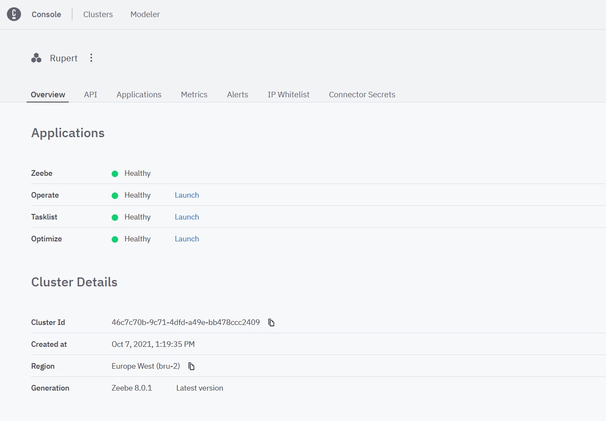
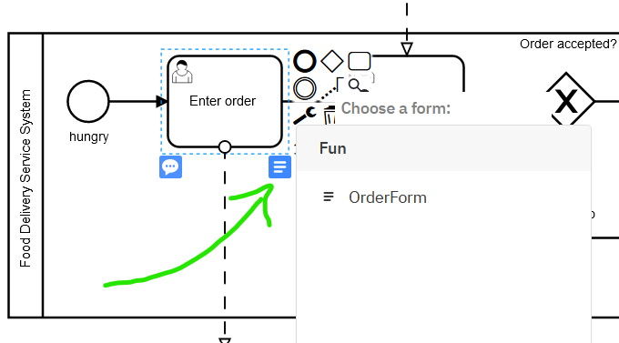
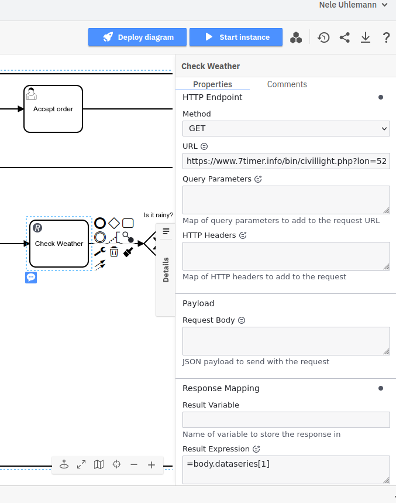

# Camunda Platform 8: Introduction Workshop


This repo contains exercises for an introductory workshop about [Camunda Platform 8](https://camunda.com) SaaS. 


:trophy: The goal of the workshop is to automate a simple process, containing [User Tasks](https://docs.camunda.io/docs/components/modeler/bpmn/user-tasks/), Service Tasks implemented as [Connectors](https://docs.camunda.io/docs/components/modeler/web-modeler/connectors/), and [Job Workers](https://docs.camunda.io/docs/components/concepts/job-workers/))

**Structure:**  
The workshop is designed as an onsite class. You can follow the exercises in the README. 
The solution folder contains the solution for each exercise and a more detailed description on how to solve the exercises. 

## Exercise 1: Sign up and create a cluster

This workshop uses Camunda Platform 8 SaaS and runs mostly in the browser, but you do need to sign up for an account, which is free, and can be done by following [this link](https://accounts.cloud.camunda.io/signup). 

Once you've signed up and verified your email, you can login to your account at [camunda.io](https://camunda.io). 

Once you're logged into your dashboard, [follow these instructions](https://docs.camunda.io/docs/components/console/manage-clusters/create-cluster/) in our documentation. 

You know you've succeed when your cluster is setup with each component showing a healthy status. 



## Exercise 2: Build a process (Web Modeler)
:trophy: The goal of this exercises is to model a BPMN diagram in Camunda [Web Modeler](https://docs.camunda.io/docs/components/modeler/web-modeler/new-web-modeler/).

**Process Description**
Imagine a known Food Delivery Service with the roles customer, restaurant, and driver. Model the process of ordering food from the perspective of the delivery service. Start simple: Limit your model to 3 user tasks and at least one exclusive (XOR) gateway. 


You can find a sample solution [here](Solution/Exercise02/02.bpmn)

:tada: You have modeled a BPMN diagram in Camunda Web Modeler.

## Exercise 3: Make the process executable

:trophy: The goal of this exercises is to add all required execution semantics to your model and deploy it. 

**Building Forms** 

Since our process is mostly User Tasks we should create a nice front end for those users to enjoy. We can do that using the Web Modeler's form builder. 

1. Make sure you're in the same directory as your process model.
1. Click `New` and select Form.
1. You can drag elements from the form elements library on the left.
1. Add properties to the form using the properties panel on the right.

You need to create a form for each user task. 
Think about the variables and options a user would need to see or add at each point of the process. 

**Important:** 

* Make sure to include a name and a email address for the task "Enter order". We need this information later on.
* Make sure the task "Accept order" includes a variable like ```acceptedRestaurant```. We need this value to route the process later. 

Once all of the forms have been built we can go back to the BPMN model and attach them.

**Adding BPMN Execution Semantics**

For each form you've built you'll need to attach it to the corresponding task you can do this by selecting the user task and clicking the form button in the lower right corner of the task.



**Adding other technical attributes**

In order to make the process executable we also have to set expressions at the outgoing sequence flows from the exclusive (XOR) gateway using the FEEL (Friendly Enough Expression Language). Select the sequence flow with 'Yes' and add ```=acceptedRestaurant =true``` for the 'No' Path use: ```=acceptedRestaurant =false```


## Exercise 4: Service Tasks (Connectors and job workers)
So far so good. Let's change the model slightly. 

After a customer has entered the order we want to check, in parallel, the weather. If the weather is bad, we would like to inform our customer that it will take longer. Model the logic into your bpmn process. You can find the solution [here](Solution/Exercise04/04.bpmn). 

### Using Camunda Platform 8 Connectors
Please note: In the model you will see two Service Tasks. In the following exercise we want to use Camunda Platform 8 Connectors to implement the logic. Connectors are only available in the Web Modeler.

### REST Connector

For the "check weather" task we want to use a REST connector (No Auth). There is an extra symbol on the context pad that allows you to open the connector catalog:


Fill in the properties panel with the following information for the URL: 

```https://www.7timer.info/bin/civillight.php?lon=52.5200&lat=13.4050&dataseries=1&ac=0&unit=metric&output=json&tzshift=0 ```

This API returns a weather forecast for Berlin (I assume we all know that Berlin has the coordinates, long = 52.5200 and lat= 13.4050). 

We just want to get the weather of today and store the first entry in the data series. Therefore we can use the following result expression :

```
=body.dataseries[1]
```



This will create the elements from the first dataseries element as process variables. Next we can use the generated variables to route the process. For us bad weather means rainy. Select the outgoing sequence flow after the exclusive (XOR) gateway and fill it in with the following expression: 

```= contains(weather, "rainy")```

You can make the other outgoing sequence flow a default flow. 

### SendGrid Connector**

For the "Send information" task we want to use the SendGrid Email Connector. 

In order to use the SendGrid Connector you need an API key. No worries in the workshop we will provide you the credentials. 

:bangbang: Never store the API key in the XML of the BPMN. So don't paste this information into the properties panel. 

Go to your cluster and navigate to "Connector Secrets". 


Create a new secret for your Sendgrid API key. Now you can reference your secret in the properties panel: 


The nice thing is, we can use FEEL to access the secret value as well as the name and the email variable. 

### Job Workers (:star2: optional task)

If you would like to build and code a job worker. You can adjust your BPMN model by adding an additional task after the driver has accepted the delivery. This task will calculate the estimated delivery time. You can check the model out [here](Solution/04/04-with-job-worker.bpmn). Make sure to set the type in the property panel to something like: ```estimatedDeliveryTime```.

Now you can build a job worker and run the job worker locally on your machine. 

The following steps are needed: 

* [Create a client](https://docs.camunda.io/docs/components/console/manage-clusters/manage-api-clients/#create-a-client) in Camunda Platform 8.
* Select a [job client](https://docs.camunda.io/docs/apis-clients/overview/) to implement your job worker.
* Follow the README of the client to implement the worker:
    * Ensure the "type" matches to the one in your model.
    * Use your Camunda client credentials in order to connect your client.


## Exercise 5: Dynamic event Handeling
🏆 You're going to deal with potential errors and send an email when they occur.

Any process needs to deal with unexpected errors, but processes with a lot of humans involved - doubly so! 

One of the best ways to deal with process errors is to 
use BPMN error events. These can be triggered in a number of ways for example if a specific task has taken too long and is no longer needed you can use a timer boundary event attached to an error event. This would cancel the task and throw a BPMN error.


In terms of execution, you need to add a duration to the timer event e.g. `PT2H` and create an error definition for the error throw event. 


Once the error is thrown, it needs to be caught and dealt with. 
This is made quite easy with the awesome power of the event sub process. 


You can then use the same send email task configuration to send an email as a response to the Error happening. 

What you need to do now is look through the model and try to find at least 3 point in which an error could occur and using a error throw event and event sup-process catch those error and send an email to the person who made the order. 
