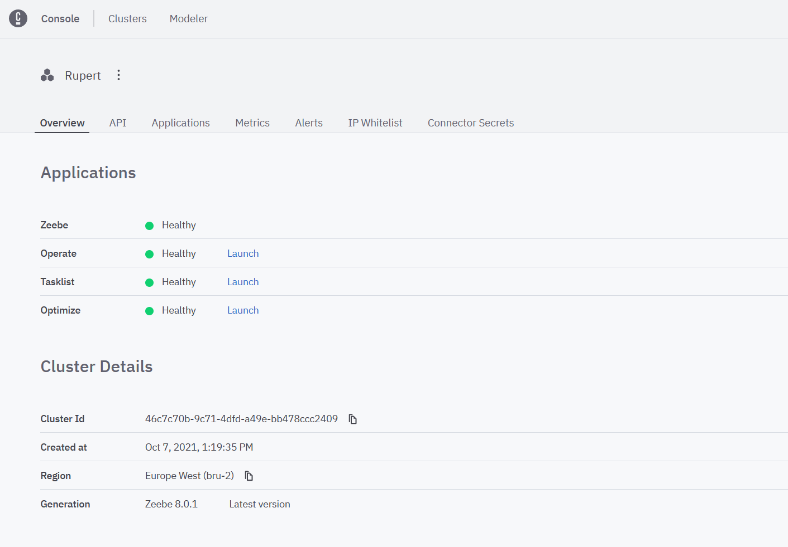
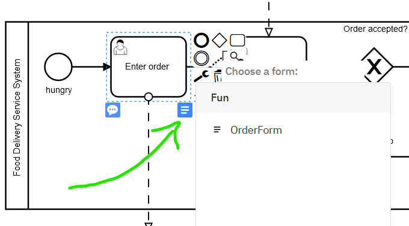

# Camunda 8: an Introduction Workshop

This repo contains exercises for a n Introduction Workshop about [Camunda 8](https://camunda.com) SaaS. 

:trophy: The Goal of the workshop is to automate a simple process (containing [User Tasks](https://docs.camunda.io/docs/components/modeler/bpmn/user-tasks/), and Service Tasks implemented as [Connectors](https://docs.camunda.io/docs/components/modeler/web-modeler/connectors/) and [Job Workers](https://docs.camunda.io/docs/components/concepts/job-workers/))

**Structure:**  
The Workshop is designed as an Onside Class. You can follow the exercises in the Readme. 
The solution folder contains the solution for each exercise and a more detailed description on how to solve the exercises. 

## Exercise 1: Sign up and create a cluster

This workshop uses Camunda Platform 8 SaaS and so the good news is that you don't have to install anything locally, but you do need to sign up for an account which is free and can be done by following [this link](https://accounts.cloud.camunda.io/signup). 

Once you're signed up you can login to your account at [camunda.io](https://weblogin.cloud.camunda.io). 

Once you're logged into your dashboard simply [follow these instructions](https://docs.camunda.io/docs/components/console/manage-clusters/create-cluster/) in our documenting. 

You'll know you've succeed when your cluster is setup and all the traffic lights are green. 

## Exercise 2: Build a process (Web Modeler)
:trophy: Goal of this exercises is to model a BPMN diagram in the Camunda [Webmodeler](https://docs.camunda.io/docs/components/modeler/web-modeler/new-web-modeler/)

**Process Description**
Imagine a known Food Delivery Service with the roles customer, restaurant and driver. Model the process of ordering food from the perspective of the delivery service. Start simple: Limit your model to 3 user tasks and at least one XOR gateway. 

You can find a sample solution [here](https://github.com/Nlea/Camunda-8_an_Introduction_Workshop/blob/main/Solution/Exercise02/delivery-process.bpmn)

:tada: You have modeled a BPMN diagramm in the Camunda Webmodeler

## Exercise 3: Make the process executable

:trophy: The Goal of this exercises is to add all required execution semantics to your model and deploy it. 

**Building Forms** 

Since our process is mostly User Tasks we should create a nice front end for those users to enjoy. We can do that using the Web Modeler's form builder. 

1. Make sure you're in the same directory as your process model
1. Click `New` and select form.
1. You can drag Elements from the libary on the left
1. Add properties using the panel on the right.

You need to create a form for each user task. 
Think about the variables and options a user would need to see or add at each point of the process. 
Once all of the forms have been built we can go back to the BPMN model and attach them

**Adding BPMN Execution Semantics**

For each form you've built you'll need to attach it to the corresponding task you can do this by selecting the user task and clicking the form button

Now it's important to be able to react to what a user has entered to ensure the process heads in the right direction. 

An XOR gateway can do this quite easily. If your form created a variable `OrderApproved` for instance you can use a gateway to decide where to go based on it's value. This is done using FEEL.

e.g. `= OrderApproved = true` or `= OrderApproved = false`

Make sure to give your process a proper name and Id then you can click deploy! 

:tada: You i've deployed your process! Feel free to start an instance and step through it!

## Exercise 4: Service Tasks (Connectors and job workers)

## Exercise 5: Dynamic event handeling
